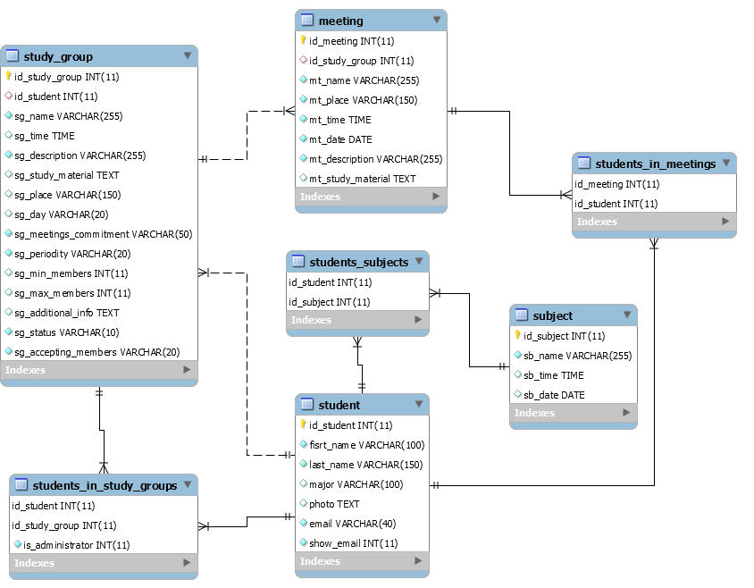

# Study Group – Project
- **platforms**: 
  - web app,
  - Nativescript app (iOS and Android)

- **description**: app made for the students of the University of Economics in Prague to seek and join or straight up create real **study groups** and collaborate on semestral projects

- **screens**: 
  - LANDING PAGE (signin/signup),
  - DASHBOARD (active study groups, messages),
  - STUDENT'S PROFILE,
  - STUDENT'S DMs, 
  - STUDY GROUPS, 
  - STUDENT'S STUDY GROUPS,
  - STUDY GROUP PROFILE,
  - STUDY GROUP MEETING,
  - STUDY GROUP CHAT,
´
## Relational Database Model
- created in PowerDesigner and MySQL Workbench

### Entities: 
- STUDENT,
- STUDY GROUP,
- MEETING,
- SUBJECT

### Most Basic FK Relationships Overview:
_Table names are in bold_
- **student** can go to multiple **meeting**s,
- **study_group** can get together in multiple **meeting**s,
- **students_in_meetings**:
  - **student** can participate in multiple **meeting**s 
  - **meeting** must have at least one **student** as a participant,
- **students_subjects**:
  - **student** can study multiple **subject**s,
  - **subject** can be studied by multiple **student**s,
- **students_in_study_groups**:
  - **student** can participate in multiple **study_group**s,
  - **study_group** can be joined by multiple **student**s,

### Database Model

